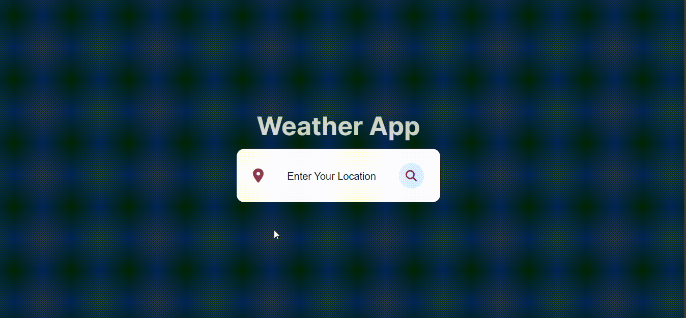

# Weather Application

## Description

This is a simple weather application that allows users to check the weather conditions of a specific city. Users can enter the name of the city in the search bar or press the "Enter" key to fetch and display the weather information including temperature, weather description, humidity, and wind speed. The application uses the OpenWeatherMap API to retrieve weather data.

## Features

- **Search by City:** Users can enter the name of a city to get the weather information for that city.
- **Keyboard Support:** Users can press the "Enter" key to search for weather information in addition to clicking the search button.
- **Weather Icons:** Weather icons change based on the current weather condition (Clear, Rain, Snow, Cloudy, Haze).

## Technologies Used

- HTML5
- CSS3
- JavaScript
- OpenWeatherMap API

## Usage

1. Clone the repository to your local machine.
   ```bash
   git clone https://github.com/your-username/weather-application.git
   ```

2. Open `index.html` in your web browser to use the weather application.

## API Key

This application uses the OpenWeatherMap API to fetch weather data. You need to obtain your API key by signing up on the [OpenWeatherMap website](https://openweathermap.org/) and replace `'YOUR_API_KEY'` in the JavaScript code (`searchWeather` function) with your actual API key.


## Credits

- Weather icons: [FontAwesome](https://fontawesome.com/icons)

## GIF



You can see the project from this link: https://weatherappprojectjs.netlify.app
